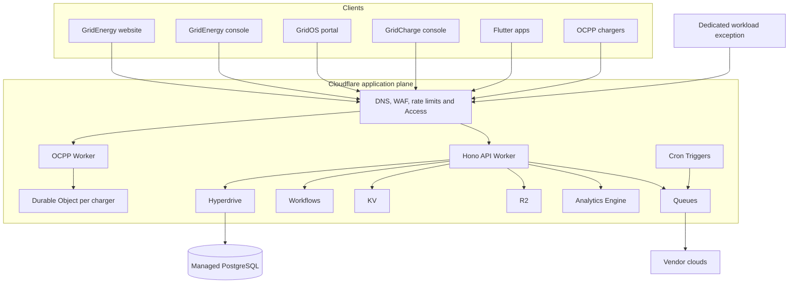

# GridEnergy Cloudflare-first architecture

## Decision

Cloudflare is the parent application compute plane. Every first-party frontend and HTTP API terminates on Workers. Managed PostgreSQL is persistence, not an alternate API surface, and is reached through Hyperdrive. A dedicated hosted instance is allowed only when a workload cannot fit the Worker execution model; it remains behind the same contracts and authorization boundary.

## Authority boundaries

1. `packages/contracts` is the source of request and response shapes.
2. `apps/api` is the sole first-party HTTP write door. It enforces tenant scope, state transitions, idempotency and audit metadata.
3. `packages/db` owns Drizzle schema and numbered migrations. Browsers and mobile clients never connect to PostgreSQL.
4. Raw vendor and OCPP events are journaled before normalization so ingestion can be replayed.
5. Mock data remains explicitly labelled until a real device, charger or customer source is connected.

## Cloudflare workload mapping

| Workload                               | Runtime                               | Reason                                                    |
| -------------------------------------- | ------------------------------------- | --------------------------------------------------------- |
| Public and console SSR                 | Workers plus Static Assets            | One global deployment and request boundary                |
| REST API                               | Hono Worker                           | Low-latency stateless application compute                 |
| Transactions and queryable telemetry   | Managed PostgreSQL through Hyperdrive | Relational integrity and provider portability             |
| Vendor ingestion                       | Cron to Queue consumer                | Bounded retries, backpressure and idempotency             |
| Commissioning and report orchestration | Workflows                             | Durable multi-step state without a resident process       |
| OCPP WebSockets                        | Durable Objects                       | Per-charger coordination with hibernating sockets         |
| Reports and binary artifacts           | R2                                    | Durable object storage                                    |
| Disposable cache and flags             | KV                                    | Read-heavy edge state only                                |
| High-volume operational counters       | Analytics Engine                      | Cheap append-oriented telemetry, not source-of-truth rows |

## Escape hatch

A dedicated instance is justified for a measured blocker such as an unsupported binary, an unbounded CPU job, a protocol requiring a resident daemon, or a database extension unavailable from the managed provider. It must sit behind Cloudflare, consume the same contracts, emit the same audit events, and never become a second client-facing authority.
